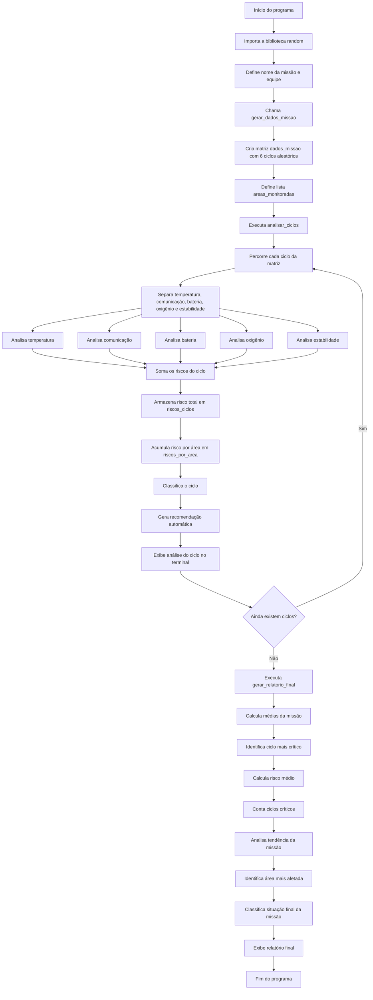

# Mission Control AI

## Descrição do Projeto

O **Mission Control AI** é um sistema desenvolvido em Python que simula o monitoramento inteligente de uma missão espacial experimental.

O programa analisa automaticamente diferentes ciclos de uma missão, verificando informações como:

* Temperatura interna;
* Comunicação com a base;
* Nível de bateria;
* Nível de oxigênio;
* Estabilidade operacional.

A partir desses dados, o sistema classifica cada informação como `NORMAL`, `ATENÇÃO` ou `CRÍTICO`, calcula o risco de cada ciclo, gera recomendações automáticas e apresenta um relatório final no terminal.

A versão atual do projeto utiliza a biblioteca `random` para gerar dados simulados diferentes a cada execução do programa.

---

## Objetivo

O objetivo do projeto é criar um sistema básico de controle de missão espacial que seja capaz de:

* Gerar dados simulados de uma missão espacial;
* Armazenar os dados em uma matriz chamada `dados_missao`;
* Analisar diferentes ciclos de monitoramento;
* Gerar alertas automáticos;
* Calcular a pontuação de risco de cada ciclo;
* Classificar a situação de cada ciclo;
* Identificar a tendência da missão;
* Identificar a área mais afetada;
* Exibir um relatório final no terminal.

---

## Tecnologias Utilizadas

* Python 3
* Biblioteca `random`
* Listas
* Matrizes
* Funções
* Estruturas condicionais
* Estruturas de repetição
* Operações matemáticas básicas

---

## Estrutura do Repositório

```text
ARM-Mission_Control_AI/
│
├── README.md
└── main.py
```

---

## Como Executar o Projeto

Para executar o projeto, é necessário ter o Python instalado na máquina.

No terminal, acesse a pasta do projeto e execute:

```bash
python main.py
```

Dependendo da instalação do Python, também pode ser necessário usar:

```bash
python3 main.py
```

---

## Estrutura dos Dados

A base principal do projeto é a matriz `dados_missao`.

Cada linha da matriz representa um ciclo de monitoramento da missão. Cada coluna representa uma informação monitorada.

A ordem obrigatória dos dados em cada ciclo é:

```python
[temperatura, comunicacao, bateria, oxigenio, estabilidade]
```

No projeto, os dados são gerados automaticamente pela função:

```python
gerar_dados_missao(quantidade_ciclos)
```

Exemplo de matriz que pode ser gerada:

```python
dados_missao = [
    [24, 92, 88, 96, 90],
    [31, 65, 58, 91, 70],
    [39, 28, 19, 78, 35],
    [34, 55, 32, 82, 50],
    [27, 80, 72, 94, 85],
    [36, 42, 38, 87, 55]
]
```

Cada ciclo possui 5 informações:

| Posição | Informação   | Unidade |
| ------: | ------------ | ------- |
|       0 | Temperatura  | °C      |
|       1 | Comunicação  | %       |
|       2 | Bateria      | %       |
|       3 | Oxigênio     | %       |
|       4 | Estabilidade | %       |

---

## Geração Aleatória dos Dados

O projeto utiliza a biblioteca `random` para gerar automaticamente os dados da missão.

A função abaixo cria os ciclos da missão:

```python
def gerar_dados_missao(quantidade_ciclos):
    dados = []
    for i in range(quantidade_ciclos):
        temperatura = random.randint(15, 42)
        comunicacao = random.randint(20, 100)
        bateria = random.randint(10, 100)
        oxigenio = random.randint(70, 100)
        estabilidade = random.randint(25, 100)
        ciclo = [temperatura, comunicacao, bateria, oxigenio, estabilidade]
        dados.append(ciclo)
    return dados
```

No código principal, a matriz é criada assim:

```python
dados_missao = gerar_dados_missao(6)
```

Isso significa que o programa gera 6 ciclos de monitoramento. Como os valores são aleatórios, cada execução pode apresentar um relatório diferente.

---

## Áreas Monitoradas

O sistema utiliza uma lista chamada `areas_monitoradas` para representar as áreas da missão relacionadas às colunas da matriz.

```python
areas_monitoradas = ["Temperatura interna", "Comunicação com a base", "Sistema de energia", "Suporte de oxigênio", "Estabilidade operacional"]
```

Essa lista é usada no relatório final para mostrar a pontuação acumulada de risco de cada área e identificar qual delas foi a mais afetada durante a missão.

---

## Regras de Classificação

Cada informação analisada pode receber uma das seguintes classificações:

| Classificação | Pontuação |
| ------------- | --------: |
| NORMAL        |         0 |
| ATENÇÃO       |         1 |
| CRÍTICO       |         2 |

Como cada ciclo possui 5 informações monitoradas, a pontuação máxima de risco por ciclo é 10 pontos.

---

## Regras para Temperatura

| Condição                  | Classificação | Pontuação |
| ------------------------- | ------------- | --------: |
| Menor que 18 °C           | ATENÇÃO       |         1 |
| De 18 °C até 30 °C        | NORMAL        |         0 |
| Maior que 30 °C até 35 °C | ATENÇÃO       |         1 |
| Maior que 35 °C           | CRÍTICO       |         2 |

Função responsável:

```python
analisar_temperatura()
```

---

## Regras para Comunicação

| Condição       | Classificação | Pontuação |
| -------------- | ------------- | --------: |
| Menor que 30%  | CRÍTICO       |         2 |
| De 30% até 59% | ATENÇÃO       |         1 |
| 60% ou mais    | NORMAL        |         0 |

Função responsável:

```python
analisar_comunicacao()
```

---

## Regras para Bateria

| Condição       | Classificação | Pontuação |
| -------------- | ------------- | --------: |
| Menor que 20%  | CRÍTICO       |         2 |
| De 20% até 49% | ATENÇÃO       |         1 |
| 50% ou mais    | NORMAL        |         0 |

Função responsável:

```python
analisar_bateria()
```

---

## Regras para Oxigênio

| Condição       | Classificação | Pontuação |
| -------------- | ------------- | --------: |
| Menor que 80%  | CRÍTICO       |         2 |
| De 80% até 89% | ATENÇÃO       |         1 |
| 90% ou mais    | NORMAL        |         0 |

Função responsável:

```python
analisar_oxigenio()
```

---

## Regras para Estabilidade

| Condição       | Classificação | Pontuação |
| -------------- | ------------- | --------: |
| Menor que 40%  | CRÍTICO       |         2 |
| De 40% até 69% | ATENÇÃO       |         1 |
| 70% ou mais    | NORMAL        |         0 |

Função responsável:

```python
analisar_estabilidade()
```

---

## Classificação dos Ciclos

Depois de analisar as cinco informações de um ciclo, o sistema soma as pontuações de risco e classifica a situação geral daquele ciclo.

| Pontuação Total | Classificação     |
| --------------: | ----------------- |
|    0 a 2 pontos | MISSÃO ESTÁVEL    |
|    3 a 5 pontos | MISSÃO EM ATENÇÃO |
|   6 a 10 pontos | MISSÃO CRÍTICA    |

Essa lógica é feita pela função:

```python
classificar_ciclo()
```

---

## Recomendações Automáticas

Com base no risco total do ciclo, o sistema gera uma recomendação automática.

| Pontuação | Recomendação                                                   |
| --------: | -------------------------------------------------------------- |
|     0 a 2 | Manter operação normal e continuar monitoramento               |
|     3 a 5 | Monitorar sistemas em atenção e preparar plano de contingência |
|    6 a 10 | Ativar modo de segurança e priorizar sistemas críticos         |

Função responsável:

```python
gerar_recomendacao()
```

---

## Análise de Tendência

A tendência da missão é calculada comparando o risco do primeiro ciclo com o risco do último ciclo.

Função responsável:

```python
analisar_tendencia()
```

A lógica utilizada é:

* Se o último risco for maior que o primeiro, a missão apresentou tendência de piora;
* Se o último risco for menor que o primeiro, a missão apresentou tendência de melhora;
* Se os dois riscos forem iguais, a missão permaneceu estável em relação ao início.

---

## Área Mais Afetada

Durante a análise dos ciclos, o sistema acumula a pontuação de risco de cada área.

A função abaixo identifica qual área acumulou o maior risco:

```python
identificar_area_mais_afetada()
```

Ela usa a lista `riscos_por_area` e compara os valores acumulados de:

* Temperatura interna;
* Comunicação com a base;
* Sistema de energia;
* Suporte de oxigênio;
* Estabilidade operacional.

---

## Cálculo das Médias

O sistema também calcula as médias gerais dos dados da missão:

* Média de temperatura;
* Média de comunicação;
* Média de bateria;
* Média de oxigênio;
* Média de estabilidade.

Esse cálculo é feito pela função:

```python
calcular_medias()
```

Essas médias são exibidas no relatório final.

---

## Principais Funções do Projeto

| Função                            | Responsabilidade                                            |
| --------------------------------- | ----------------------------------------------------------- |
| `gerar_dados_missao()`            | Gera dados aleatórios para os ciclos da missão              |
| `analisar_temperatura()`          | Analisa a temperatura do ciclo                              |
| `analisar_comunicacao()`          | Analisa a comunicação com a base                            |
| `analisar_bateria()`              | Analisa o nível de bateria                                  |
| `analisar_oxigenio()`             | Analisa o nível de oxigênio                                 |
| `analisar_estabilidade()`         | Analisa a estabilidade operacional                          |
| `classificar_ciclo()`             | Classifica o ciclo com base no risco total                  |
| `gerar_recomendacao()`            | Gera uma recomendação automática                            |
| `analisar_tendencia()`            | Verifica se a missão melhorou, piorou ou permaneceu estável |
| `identificar_area_mais_afetada()` | Identifica a área com maior risco acumulado                 |
| `calcular_medias()`               | Calcula as médias dos dados da missão                       |
| `analisar_ciclos()`               | Percorre todos os ciclos e exibe a análise individual       |
| `gerar_relatorio_final()`         | Exibe o relatório final da missão                           |

---

## Fluxograma do Sistema



---

## Funcionamento Geral

O funcionamento do programa segue esta sequência:

1. A biblioteca `random` é importada;
2. A função `gerar_dados_missao()` cria os dados aleatórios da missão;
3. A matriz `dados_missao` armazena os ciclos de monitoramento;
4. A função `analisar_ciclos()` percorre cada ciclo da matriz;
5. Cada valor do ciclo é enviado para sua função de análise;
6. Cada função retorna uma classificação, uma pontuação e uma mensagem;
7. O risco total do ciclo é calculado;
8. O ciclo é classificado como estável, em atenção ou crítico;
9. Uma recomendação automática é gerada;
10. Os riscos são acumulados para o relatório final;
11. A função `gerar_relatorio_final()` exibe a análise geral da missão.

---

## Exemplo de Saída no Terminal

Como os dados são aleatórios, a saída pode mudar a cada execução.

Exemplo:

```text
============================================================
MISSION CONTROL AI
============================================================
Missão: Orion Test Alpha
Equipe: Equipe Apollo
Quantidade de ciclos analisados: 6
============================================================

CICLO 1
------------------------------------------------------------
Temperatura: 29 °C | NORMAL | Temperatura estável
Comunicação: 74% | NORMAL | Comunicação estável
Bateria: 45% | ATENÇÃO | Bateria abaixo do recomendado
Oxigênio: 93% | NORMAL | Oxigênio adequado
Estabilidade: 68% | ATENÇÃO | Estabilidade operacional reduzida

Pontuação de risco do ciclo: 2
Classificação do ciclo: MISSÃO ESTÁVEL
Recomendação: Manter operação normal e continuar monitoramento.
```

Ao final, o sistema exibe um relatório com:

* Quantidade de ciclos analisados;
* Médias dos indicadores;
* Ciclo mais crítico;
* Maior pontuação de risco;
* Risco médio da missão;
* Quantidade de ciclos críticos;
* Tendência da missão;
* Pontuação acumulada por área;
* Área mais afetada;
* Classificação final da missão;
* Conclusão.

---

## Requisitos Atendidos

O projeto atende aos seguintes requisitos:

* Nome da missão;
* Nome da equipe;
* Matriz `dados_missao`;
* Pelo menos 6 ciclos de monitoramento;
* Cada ciclo com 5 informações;
* Lista com áreas monitoradas;
* Uso de funções;
* Uso de estruturas condicionais;
* Uso de estrutura de repetição;
* Cálculo de risco por ciclo;
* Classificação de cada ciclo;
* Análise de tendência;
* Identificação da área mais afetada;
* Relatório final exibido no terminal.

---

## Observação sobre os Dados Aleatórios

Como o projeto utiliza a biblioteca `random`, cada execução gera dados diferentes para a missão.

Isso faz com que o relatório final também possa mudar a cada execução. Essa característica torna a simulação mais dinâmica, pois o sistema precisa analisar situações diferentes em cada rodada.

---

## Integrantes

* Arthur de Oliveira — RM: 568986
* Miguel Piedade — RM: 572445
* Rafael Zani — RM: 569033

---

## Conclusão

O **Mission Control AI** demonstra como a lógica de programação pode ser aplicada em um sistema de monitoramento espacial.

Através do uso de funções, listas, matriz, estruturas condicionais e repetição, o programa consegue analisar dados simulados, gerar alertas, calcular riscos e apresentar um relatório final organizado para apoiar a tomada de decisão durante uma missão espacial experimental.
