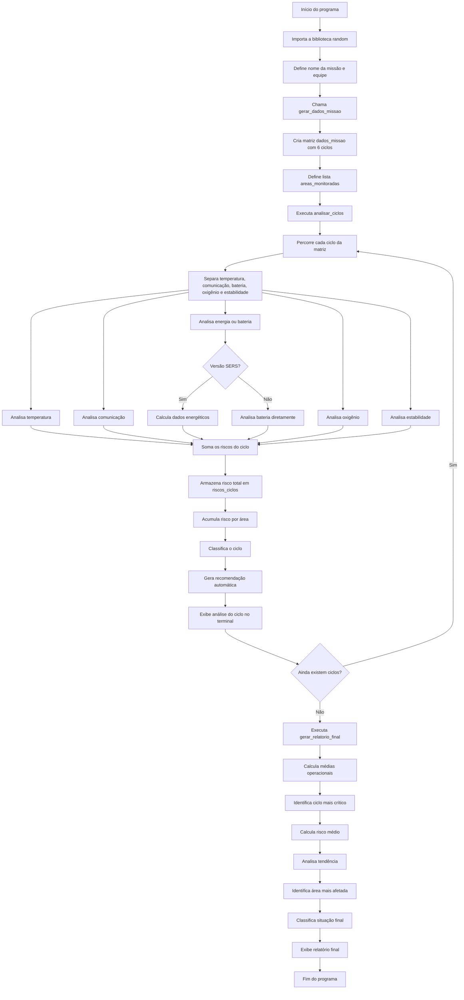

# Mission Control AI

## Visão Geral

O **Mission Control AI** é um sistema desenvolvido em **Python** que simula o monitoramento inteligente de uma missão espacial experimental.

O projeto foi estruturado para atender à proposta da **Global Solution de Pensamento Computacional e Automação com Python** e também foi adaptado para a **Global Solution de Soluções em Energias Renováveis e Sustentáveis (SERS)**.

A solução analisa ciclos de uma missão espacial, gera alertas automáticos, calcula risco operacional, identifica a tendência da missão, aponta a área mais afetada e exibe um relatório final no terminal.

Na versão adaptada para SERS, o sistema também realiza uma análise energética sustentável, considerando bateria, geração solar simulada, consumo operacional, saldo energético e eficiência energética.

---

## Tema da Solução

**Mission Control AI — Sistema Inteligente de Monitoramento de Missão Espacial com Análise Operacional e Energética Sustentável**

A proposta representa uma central de controle capaz de acompanhar os principais indicadores de uma missão espacial experimental, simulando decisões automáticas diante de situações críticas.

---

## Objetivo do Projeto

O objetivo do projeto é desenvolver um sistema básico de controle de missão espacial capaz de:

- Gerar dados simulados de uma missão;
- Armazenar os dados em uma matriz chamada `dados_missao`;
- Analisar diferentes ciclos de monitoramento;
- Gerar alertas automáticos;
- Calcular a pontuação de risco de cada ciclo;
- Classificar a situação de cada ciclo;
- Identificar a tendência geral da missão;
- Identificar a área mais afetada durante a operação;
- Gerar recomendações automáticas;
- Exibir um relatório final organizado no terminal;
- Simular indicadores de energia renovável e sustentabilidade na versão SERS.

---

## Aderência à Global Solution de Python

A versão `mission_control.py` atende aos requisitos da GS de Python por meio de:

- Uso de matriz principal `dados_missao`;
- Mínimo de 6 ciclos de monitoramento;
- Cada ciclo contendo 5 informações na ordem obrigatória:
  `[temperatura, comunicacao, bateria, oxigenio, estabilidade]`;
- Uso de lista `areas_monitoradas`;
- Uso de funções;
- Uso de estruturas condicionais;
- Uso de estrutura de repetição;
- Cálculo de risco por ciclo;
- Classificação de cada ciclo;
- Análise de tendência;
- Identificação da área mais afetada;
- Relatório final exibido no terminal.

---

## Aderência à Global Solution de SERS

A versão `mission_control_sers.py` adapta o projeto para o tema de **Soluções em Energias Renováveis e Sustentáveis**.

Nessa versão, a coluna `bateria` continua fazendo parte da matriz principal exigida pela GS de Python, mas também é interpretada como parte do **sistema energético da missão**.

A partir dela, o sistema calcula indicadores relacionados a energia, potência e sustentabilidade:

- Energia armazenada na bateria;
- Potência solar máxima simulada;
- Geração solar estimada por ciclo;
- Consumo operacional estimado;
- Saldo energético;
- Eficiência energética;
- Impacto sustentável da solução;
- Recomendações para economia de energia e priorização de módulos essenciais.

Dessa forma, o projeto deixa de ser apenas um monitoramento operacional e passa a representar também um sistema de apoio à tomada de decisão energética em uma missão espacial experimental.

---

## Tecnologias Utilizadas

- Python 3;
- Biblioteca `random`;
- Listas;
- Matrizes;
- Funções;
- Estruturas condicionais;
- Estruturas de repetição;
- Operações matemáticas básicas;
- Simulação de indicadores energéticos.

---

## Estrutura do Repositório

```text
ARM-Mission_Control_AI/
│
├── README.md
├── mission_control.py
└── mission_control_sers.py
```

### Descrição dos Arquivos

| Arquivo | Descrição |
|---|---|
| `README.md` | Documentação geral do projeto |
| `mission_control.py` | Versão principal voltada à GS de Python |
| `mission_control_sers.py` | Versão adaptada para SERS, com análise energética sustentável |

---

## Como Executar o Projeto

Para executar o projeto, é necessário ter o **Python 3** instalado na máquina.

No terminal, acesse a pasta do projeto.

### Executar a versão da GS de Python

```bash
python mission_control.py
```

Dependendo da instalação do Python, pode ser necessário usar:

```bash
python3 mission_control.py
```

### Executar a versão adaptada para SERS

```bash
python mission_control_sers.py
```

Ou:

```bash
python3 mission_control_sers.py
```

---

## Estrutura dos Dados

A base principal do projeto é a matriz `dados_missao`.

Cada linha da matriz representa um ciclo de monitoramento da missão. Cada coluna representa uma informação monitorada.

A ordem obrigatória dos dados em cada ciclo é:

```python
[temperatura, comunicacao, bateria, oxigenio, estabilidade]
```

Exemplo:

```python
dados_missao = [
    [24, 92, 88, 96, 90],
    [31, 65, 58, 91, 70],
    [39, 28, 19, 78, 35],
    [34, 55, 32, 82, 50],
    [27, 80, 72, 94, 85],
    [36, 42, 38, 87, 55]
]
```

Cada ciclo possui 5 informações:

| Posição | Informação | Unidade | Significado |
|---:|---|---|---|
| 0 | Temperatura | °C | Temperatura interna do módulo |
| 1 | Comunicação | % | Qualidade do sinal com a base |
| 2 | Bateria | % | Nível do sistema energético da missão |
| 3 | Oxigênio | % | Nível de oxigênio disponível |
| 4 | Estabilidade | % | Estabilidade geral dos sistemas |

---

## Geração dos Dados Simulados

O projeto utiliza a biblioteca `random` para gerar automaticamente os dados da missão.

A função responsável por isso é:

```python
def gerar_dados_missao(quantidade_ciclos):
    dados = []
    for i in range(quantidade_ciclos):
        temperatura = random.randint(15, 42)
        comunicacao = random.randint(20, 100)
        bateria = random.randint(10, 100)
        oxigenio = random.randint(70, 100)
        estabilidade = random.randint(25, 100)
        ciclo = [temperatura, comunicacao, bateria, oxigenio, estabilidade]
        dados.append(ciclo)
    return dados
```

No código principal, a matriz é criada com 6 ciclos:

```python
dados_missao = gerar_dados_missao(6)
```

Como os dados são aleatórios, cada execução pode gerar uma situação diferente para a missão.

---

## Áreas Monitoradas

A lista `areas_monitoradas` relaciona cada coluna da matriz com uma área da missão.

Na versão principal, a lista é organizada dessa forma:

```python
areas_monitoradas = [
    "Temperatura interna",
    "Comunicação com a base",
    "Sistema de energia",
    "Suporte de oxigênio",
    "Estabilidade operacional"
    ]
```

Na versão SERS, a área de energia foi personalizada para destacar o foco sustentável:

```python
areas_monitoradas = [
    "Temperatura interna",
    "Comunicação com a base",
    "Sistema de energia renovável",
    "Suporte de oxigênio",
    "Estabilidade operacional"
]
```

Essa lista é usada para calcular a pontuação acumulada por área e identificar qual sistema foi mais afetado durante a missão.

---

## Regras de Classificação

Cada informação analisada pode receber uma das seguintes classificações:

| Classificação | Pontuação |
|---|---:|
| `NORMAL` | 0 |
| `ATENÇÃO` | 1 |
| `CRÍTICO` | 2 |

Como cada ciclo possui 5 informações monitoradas, a pontuação máxima de risco por ciclo é 10 pontos.

---

## Regras para Temperatura

| Condição | Classificação | Pontuação |
|---|---|---:|
| Menor que 18 °C | ATENÇÃO | 1 |
| De 18 °C até 30 °C | NORMAL | 0 |
| Maior que 30 °C até 35 °C | ATENÇÃO | 1 |
| Maior que 35 °C | CRÍTICO | 2 |

Função responsável:

```python
analisar_temperatura()
```

---

## Regras para Comunicação

| Condição | Classificação | Pontuação |
|---|---|---:|
| Menor que 30% | CRÍTICO | 2 |
| De 30% até 59% | ATENÇÃO | 1 |
| 60% ou mais | NORMAL | 0 |

Função responsável:

```python
analisar_comunicacao()
```

---

## Regras para Energia/Bateria

Na versão original de Python, o sistema analisa diretamente o nível de bateria pela função:

```python
analisar_bateria()
```

Na versão SERS, a bateria é analisada de forma mais completa pela função:

```python
analisar_energia()
```

Essa função considera:

- Nível de bateria;
- Saldo energético;
- Eficiência energética;
- Consumo operacional;
- Geração solar estimada.

### Regras principais da versão Python

| Condição | Classificação | Pontuação |
|---|---|---:|
| Menor que 20% | CRÍTICO | 2 |
| De 20% até 49% | ATENÇÃO | 1 |
| 50% ou mais | NORMAL | 0 |

### Regras adicionais da versão SERS

| Situação | Classificação | Ação recomendada |
|---|---|---|
| Bateria abaixo de 20% | CRÍTICO | Ativar modo de economia |
| Consumo muito maior que a geração renovável | CRÍTICO | Reduzir módulos não essenciais |
| Bateria abaixo de 50% | ATENÇÃO | Priorizar recarga e economia |
| Saldo energético negativo | ATENÇÃO | Monitorar geração solar |
| Eficiência energética baixa | ATENÇÃO | Reduzir desperdício energético |
| Energia renovável suficiente | NORMAL | Manter operação padrão |

---

## Regras para Oxigênio

| Condição | Classificação | Pontuação |
|---|---|---:|
| Menor que 80% | CRÍTICO | 2 |
| De 80% até 89% | ATENÇÃO | 1 |
| 90% ou mais | NORMAL | 0 |

Função responsável:

```python
analisar_oxigenio()
```

---

## Regras para Estabilidade

| Condição | Classificação | Pontuação |
|---|---|---:|
| Menor que 40% | CRÍTICO | 2 |
| De 40% até 69% | ATENÇÃO | 1 |
| 70% ou mais | NORMAL | 0 |

Função responsável:

```python
analisar_estabilidade()
```

---

## Classificação dos Ciclos

Depois de analisar as cinco informações de um ciclo, o sistema soma as pontuações de risco e classifica a situação geral daquele ciclo.

| Pontuação Total | Classificação |
|---:|---|
| 0 a 2 pontos | MISSÃO ESTÁVEL |
| 3 a 5 pontos | MISSÃO EM ATENÇÃO |
| 6 a 10 pontos | MISSÃO CRÍTICA |

Função responsável:

```python
classificar_ciclo()
```

---

## Recomendações Automáticas

O sistema gera recomendações automáticas de acordo com os riscos identificados.

Na versão original, a recomendação é baseada principalmente no risco total do ciclo.

Na versão SERS, a recomendação considera também os sistemas mais críticos e a situação energética da missão.

Exemplos de recomendações:

| Situação | Recomendação |
|---|---|
| Operação estável | Manter operação normal e conservar energia renovável |
| Sistema energético crítico | Ativar modo de economia e desligar módulos não essenciais |
| Oxigênio crítico | Acionar protocolo de suporte à vida |
| Temperatura crítica | Acionar controle térmico |
| Comunicação crítica | Reorientar antenas e tentar restabelecer contato |
| Estabilidade crítica | Ativar modo de segurança |
| Saldo energético negativo | Reduzir desperdício energético e preparar contingência |

Função responsável na versão SERS:

```python
gerar_recomendacao()
```

---

## Análise Energética Sustentável — SERS

A versão `mission_control_sers.py` possui constantes que simulam características energéticas da missão:

```python
CAPACIDADE_BATERIA_KWH = 500
POTENCIA_SOLAR_MAX_KW = 80
CONSUMO_BASE_KW = 45
DURACAO_CICLO_HORAS = 1
```

Essas constantes são usadas para transformar a porcentagem da bateria em indicadores ligados a energia e sustentabilidade.

### Indicadores Calculados

| Indicador | Descrição |
|---|---|
| Energia armazenada | Estimativa de energia disponível na bateria em kWh |
| Geração solar estimada | Energia gerada pelos painéis solares no ciclo |
| Consumo operacional | Energia consumida pelos módulos da missão |
| Saldo energético | Diferença entre geração e consumo |
| Eficiência energética | Percentual da demanda coberto pela geração renovável |

Função responsável:

```python
calcular_dados_energeticos()
```

### Lógica da Simulação Energética

A geração solar simulada considera:

- Potência máxima dos painéis solares;
- Duração do ciclo;
- Temperatura do módulo;
- Estabilidade operacional.

O consumo operacional considera:

- Consumo base dos módulos essenciais;
- Consumo adicional caso a comunicação esteja instável;
- Consumo adicional em caso de baixa estabilidade;
- Consumo adicional em caso de temperatura fora do ideal.

Assim, o sistema consegue simular cenários em que a missão gera energia suficiente ou precisa economizar recursos.

---

## Resumo Energético Final — SERS

No relatório final da versão SERS, o sistema exibe um bloco chamado:

```text
Resumo energético sustentável - SERS
```

Esse bloco apresenta:

- Capacidade máxima simulada da bateria;
- Potência solar máxima simulada;
- Energia armazenada média;
- Geração solar total estimada;
- Consumo operacional total estimado;
- Saldo energético total;
- Eficiência energética média.

Essas informações reforçam a relação do projeto com energia renovável, potência, consumo, eficiência e sustentabilidade.

---

## Cálculo das Médias

O sistema calcula as médias gerais dos dados da missão:

- Média de temperatura;
- Média de comunicação;
- Média de bateria;
- Média de oxigênio;
- Média de estabilidade.

Função responsável:

```python
calcular_medias()
```

---

## Análise de Tendência

A tendência da missão é calculada comparando o risco do primeiro ciclo com o risco do último ciclo.

A lógica utilizada é:

- Se o último risco for maior que o primeiro, a missão apresentou tendência de piora;
- Se o último risco for menor que o primeiro, a missão apresentou tendência de melhora;
- Se os dois riscos forem iguais, a missão permaneceu estável em relação ao início.

Função responsável:

```python
analisar_tendencia()
```

---

## Área Mais Afetada

Durante a análise dos ciclos, o sistema acumula a pontuação de risco de cada área.

A função `identificar_area_mais_afetada()` identifica qual área acumulou o maior risco ao longo de toda a missão.

As áreas analisadas são:

- Temperatura interna;
- Comunicação com a base;
- Sistema de energia renovável;
- Suporte de oxigênio;
- Estabilidade operacional.

---

## Principais Funções do Projeto

| Função | Arquivo | Responsabilidade |
|---|---|---|
| `gerar_dados_missao()` | Ambos | Gera dados simulados para os ciclos da missão |
| `analisar_temperatura()` | Ambos | Analisa a temperatura do ciclo |
| `analisar_comunicacao()` | Ambos | Analisa a comunicação com a base |
| `analisar_bateria()` | `mission_control.py` | Analisa o nível de bateria |
| `analisar_energia()` | `mission_control_sers.py` | Analisa bateria, saldo energético e eficiência |
| `analisar_oxigenio()` | Ambos | Analisa o nível de oxigênio |
| `analisar_estabilidade()` | Ambos | Analisa a estabilidade operacional |
| `calcular_dados_energeticos()` | `mission_control_sers.py` | Calcula energia armazenada, geração solar, consumo, saldo e eficiência |
| `calcular_resumo_energetico()` | `mission_control_sers.py` | Calcula o resumo energético final da missão |
| `classificar_ciclo()` | Ambos | Classifica o ciclo com base no risco total |
| `gerar_recomendacao()` | Ambos | Gera recomendação automática |
| `analisar_tendencia()` | Ambos | Verifica se a missão melhorou, piorou ou permaneceu estável |
| `identificar_area_mais_afetada()` | Ambos | Identifica a área com maior risco acumulado |
| `calcular_medias()` | Ambos | Calcula as médias dos indicadores |
| `analisar_ciclos()` | Ambos | Percorre todos os ciclos e exibe a análise individual |
| `gerar_relatorio_final()` | Ambos | Exibe o relatório final da missão |

---

## Fluxograma Geral do Sistema



---

## Funcionamento Geral

O funcionamento do programa segue esta sequência:

1. A biblioteca `random` é importada;
2. A função `gerar_dados_missao()` cria os dados simulados;
3. A matriz `dados_missao` armazena os ciclos de monitoramento;
4. A função `analisar_ciclos()` percorre cada ciclo da matriz;
5. Cada valor do ciclo é enviado para sua função de análise;
6. Cada função retorna uma classificação, uma pontuação e uma mensagem;
7. Na versão SERS, os dados energéticos também são calculados;
8. O risco total do ciclo é calculado;
9. O ciclo é classificado como estável, em atenção ou crítico;
10. Uma recomendação automática é gerada;
11. Os riscos são acumulados para o relatório final;
12. A função `gerar_relatorio_final()` exibe a análise geral da missão.

---

## Exemplo de Saída no Terminal

Como os dados são aleatórios, a saída pode mudar a cada execução.

### Exemplo da versão principal

```
============================================================
MISSION CONTROL AI
============================================================
Missão: Artemis III Test Alpha
Equipe: Equipe ARM
Quantidade de ciclos analisados: 6
============================================================

CICLO 1
------------------------------------------------------------
Temperatura: 29 °C | NORMAL | Temperatura estável
Comunicação: 74% | NORMAL | Comunicação estável
Bateria: 45% | ATENÇÃO | Bateria abaixo do recomendado
Oxigênio: 93% | NORMAL | Oxigênio adequado
Estabilidade: 68% | ATENÇÃO | Estabilidade operacional reduzida

Pontuação de risco do ciclo: 2
Classificação do ciclo: MISSÃO ESTÁVEL
Recomendação: Manter operação normal e continuar monitoramento.
```

### Exemplo da versão SERS

```
============================================================
MISSION CONTROL AI - SERS
============================================================
Missão: Artemis III Test Alpha
Equipe: Equipe ARM
Quantidade de ciclos analisados: 6
============================================================

CICLO 1
------------------------------------------------------------
Temperatura: 29 °C | NORMAL | Temperatura estável.
Comunicação: 74% | NORMAL | Comunicação estável.
Energia/Bateria: 45% | ATENÇÃO | Bateria abaixo do recomendado. Priorizar recarga e economia.
Oxigênio: 93% | NORMAL | Oxigênio adequado.
Estabilidade: 68% | ATENÇÃO | Estabilidade operacional reduzida.

Indicadores energéticos simulados:
Energia armazenada: 225.00 kWh
Geração solar estimada: 54.40 kWh
Consumo operacional estimado: 53.00 kWh
Saldo energético: 1.40 kWh
Eficiência energética: 102.64%

Pontuação de risco do ciclo: 2
Classificação do ciclo: MISSÃO ESTÁVEL
Recomendação: Manter operação normal, seguir monitoramento e conservar energia renovável.
```

Ao final, o sistema exibe um relatório com:

- Quantidade de ciclos analisados;
- Médias dos indicadores operacionais;
- Resumo energético sustentável;
- Ciclo mais crítico;
- Maior pontuação de risco;
- Risco médio da missão;
- Quantidade de ciclos críticos;
- Tendência da missão;
- Pontuação acumulada por área;
- Área mais afetada;
- Classificação final da missão;
- Conclusão;
- Impacto sustentável da solução.

---

## Observação sobre os Dados Aleatórios

Como o projeto utiliza a biblioteca `random`, cada execução gera dados diferentes para a missão.

Isso torna a simulação mais dinâmica, pois o sistema precisa analisar situações diferentes em cada rodada.

Para fins de apresentação em vídeo, é possível executar o programa mais de uma vez até obter uma saída que demonstre melhor os alertas e o relatório final.

---

## Integrantes

- Arthur de Oliveira — RM: 568986
- Miguel Piedade — RM: 572445
- Rafael Zani — RM: 569033

---

## Conclusão

O **Mission Control AI** demonstra como a lógica de programação pode ser aplicada em um sistema inteligente de monitoramento espacial.

Através do uso de funções, listas, matriz, estruturas condicionais e repetição, o programa consegue analisar dados simulados, gerar alertas, calcular riscos e apresentar um relatório final organizado para apoiar a tomada de decisão durante uma missão espacial experimental.

A versão adaptada para SERS amplia a proposta original ao incluir uma camada de análise energética sustentável, simulando o uso de energia renovável, controle de consumo, cálculo de eficiência e recomendações para economia de energia.

Dessa forma, o projeto conecta programação, pensamento computacional, sustentabilidade e monitoramento inteligente em uma única solução.